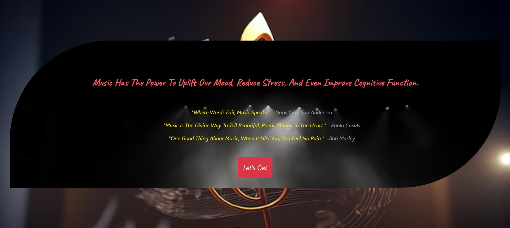

# 🎵 Music Heals Depression - Website

**A simple, soothing website dedicated to emotional healing through music.**  
This static project demonstrates how web development can support mental well-being.

## 🔗 Live Website  
[Click to View](https://praveenkumarkota-dev.github.io/music-heals-depression/)

---

## 🔍 Overview

This multi-page website helps users:
- Explore comforting and motivational songs 🎶
- Read meaningful descriptions that connect emotions with music 🧠
- Watch embedded videos directly without redirects 🎥
   
---

## 💡 Features

- 🧠 Mental health awareness through curated music
- 🎧 Responsive song cards with Bootstrap buttons
- 🔗 On-click navigation between pages
- 📱 Mobile-friendly layout for all screen sizes
 
---

## 🛠️ Tech Stack  
- HTML, CSS
- Bootstrap (Outline Buttons, Cards)
- Flexbox for layout
- Custom Icons + Emojis for UI
  
---

## 🖼️ Project Preview  

---

## 📂 Project Structure
music-heals-depression/
├── index.html
├── songs.html
├── song-detail.html
├── styles.css
└── assets/
├── images/
└── videos/

---

## 📌 GitHub Repository

🔗 [View Code on GitHub](https://github.com/praveenkumarkota-dev/music-heals-depression)

---

## 📊 GitHub Stats  

---

## 🙌 Acknowledgements

Made with 💙 at **NxtWave CCBP 4.0 Intensive**  
Special thanks to all those who believe in the healing power of music.

---

## 📬 Contact

Have feedback or suggestions? Feel free to connect with me:

---

> Made with ❤️ by Praveen Kumar Kota

